# OT4U - Occupational Therapy for everyone

<a id="top"></a>
## Table of Contents
<details>
<summary>Overview</summary>

[Who is this app for?](#who-for)

[What does it do?](#what-do)

</details>
<details>
<summary>Screen Mockup</summary>

[Screen Mockup](#mockup)

</details>
<details>
<summary>Features</summary>

[Existing Features](#existing-features)
	
[Known Bugs](#known-bugs)

[Future features](#future-features)

</details>
<details>
<summary>Data Model</summary>

[Entity Model](#entity-diagram)

[Entity Relationship Model](#erd)

[Python Structure](#python-structure)

</details>
<details>
<summary>UX</summary>

[Storyboard](#storyboard)

[Personas](#personas)

[Customer Journey Maps](#cjm)

[Wireframes](#wireframes)

[Flow Chart](#flow-chart)

[Site Map](#site-map)

[Accessibility](#accessibility)

</details>
<details>
<summary>Design Decisions</summary>

[Colours](#colours)

[Usability](#usability)

</details>
<details>
<summary>Software Development Process</summary>

[Agile Methodology](#agile)

[Project Planning](#planning)

[Version control](#git)

[Testing](#testing)

[Documentation](#documentation)

[Deployment](#deployment)

</details>
<details>
<summary>Technology Used</summary>

[Technology Used](#technology)

</details>
<details>
<summary>Contributing</summary>

[Clone](#clone)

[Fork](#fork)

[Clone versus Fork](#clone-fork)

</details>
<details>
<summary>Credit</summary>

[Credit](#credit)

</details>

## Overview
[Back to Top](#top)


### Who is this website for?
<a id="who-for"></a>
[Back to Top](#top)
This website is for people who are looking for some Occupational Therapy in order to solve some physical problems/issues that they may have.
 
 
### What does it do?
<a id="what-do"></a>
[Back to Top](#top)
This website allows people with physical ailments to access and book a variety of different Occupational Therapies.
  
 
### How does it work
<a id="how-work"></a>
[Back to Top](#top)
The Occupational Therapist (or Site Owner) adds a list of the Occupational Therapy services that she offers onto the website.  The client visits the website and books a number of sessions of the particular type of Occupational Therapy that they need.


## Screen Mockup
<a id="mockup"></a>
[Back to Top](#top)


## User Stories
[Back to Top](#top)

The user stories have been divided into different epics:

1. Site Navigation
2. Account Management
3. Sorting
4. Searching
5. Purchase Sessions
6. Maintain Configuration

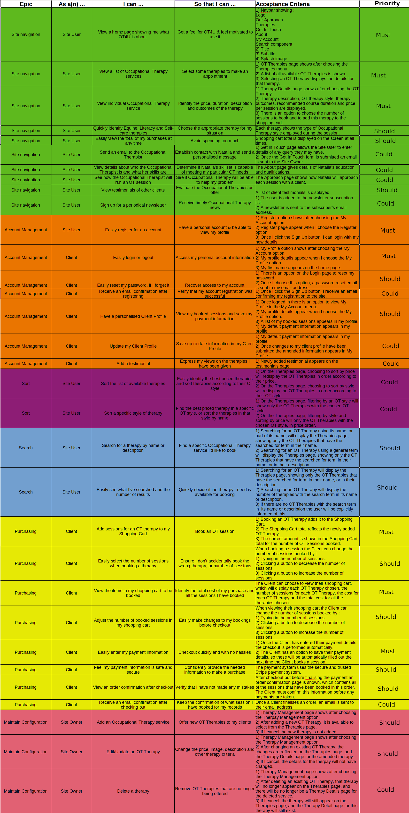


## Features
[Back to Top](#top)

### Existing Features
<a id="existing-features"></a>

#### Inital Landing page
[Back to Top](#top)

This is where the user arrives on first entering the site.  This page sets the theme for the application, with a Logo which when clicked will bring the user back to the home page.

| Desktop    | Mobile    |
| --- | --- |
|     |     |


#### Navigation
[Back to Top](#top)
Each page has a header at the top of the page which contains a logo and a NavBar.

On small screen devices the NavBar is accessible by clicking the well recognised "hamburger" icon.  The user is shown a responsive menu on small screen devices.  

The NavBar contains links to the 6 main pages. The NavBar is used so that the client can navigate easily between the major sections of the OT4U website, on every device.

|  Desktop   |  Mobile   |
| --- | --- |
|     |     |

Hovering over the Therapies menu (clicking on it on mobile devices) will expose a dropdown menu with further options.

|  Desktop   |  Mobile   |
| --- | --- |
|     |     |


On any page if the user clicks the logo they will be redirected to the OT4U home page.  The benefit of this is that it is a consistent behaviour across the entire website.  Also every NavBar has a "Home" link which will also always give the user the option to return to the home page of the OT4U application.  This means that the user can always get back to the home page, no matter where they are in the application.

**Footer Navigation**

In the footer of every page there are a number of navigation links: 
1. About Natalia
	A link to the About page
	
3. Get in Touch
	A link to the Contact/Get in Touch page
	
5. Privacy Policy
	A link to the Privacy Policy page
	
7. Newsletter
	A link to the "Subscribe to our newsletter" page
	
9. Code Institute - Full Stack Diploma
	A link to an external site (Code Institute)

|   Desktop  |  Mobile   |
| --- | --- |
|     |     |


#### Track Clients Profile
[Back to Top](#top)

In the top right of every screen there is a "My Profile" link, which exposes a number of options.

Supporting screen elements - **My Profile - Not logged in**

|   Desktop  |  Mobile   |
| --- | --- |
|     |     |

Supporting screen elements - **My Profile - Logged in**

|   Desktop  |  Mobile   |
| --- | --- |
|     |     |


The 'My Profile' menu allows the client to Login or Register, if they are not logged in already.  Once logged in this link allows the user to Logout or view their Profile.  If the user is logged in as the "Site Owner" this link will also allow them to modify the therapies on offer to their clients.

As part of the Purchase feature, the client can provide default information to be used whenever they are making a purchase.  They do this by clicking the checkbox underneath the client information form which asks if the want to save this information in their profile.

By giving the client the choice in this matter it makes them feel that the OT4U website is not forcing them to store their valuable data without their knowledge.  This makes them feel more confident in the OT4U website, just knowing that it values their privacy.

The key benefit to saving this profile information is that the next time the client makes a purchase their profile information will automatically be populated into the form fields for them.  This makes the whole process of purchasing therapy sessions quicker and improves its ease of use.  The client does not have as much to remember and so it is much easier to learn how the OT4U website works.

Support screen elements - **Save Info checkbox**

|   Desktop  |  Mobile   |
| --- | --- |
|     |     |

#### Update Client Profile
[Back to Top](#top)


When the client clicks the "My Profile" link in the "My Profile" menu, they are taken to their profile page.  This page shows them what profile data the OT4U website has stored for them.  It also allows them to update this information.  The benefit of this is that the client is in control of the information and can amend it whenever their circumstances change.

A second part of this feature is that while viewing their profile, the client can also see a history of all the orders they have placed.  The benefit of this feature is that the client can see what therapies they have booked previously, and can use this information to figure out what therapies work for them.  They also see how much their therapies are costing, which allows the client to make financial decisions based on past data.

Supporting pages - **Client Profile**

|   Desktop  |  Mobile   |
| --- | --- |
|     |     |


#### Login
[Back to Top](#top)


In order to buy any of the Therapies offered by the OT4U application a client must use the Login feature.  
The purpose of the login feature is to allow the client access to the shopping cart and "My Profile" features of the website.  It also ensures that the Site Owner has contact details for all clients.  This will be needed to make an appointment with the client.

Supporting page - **Login page**

|  Desktop   |  Mobile   |
| --- | --- |
|     |     |


#### Logout
[Back to Top](#top)

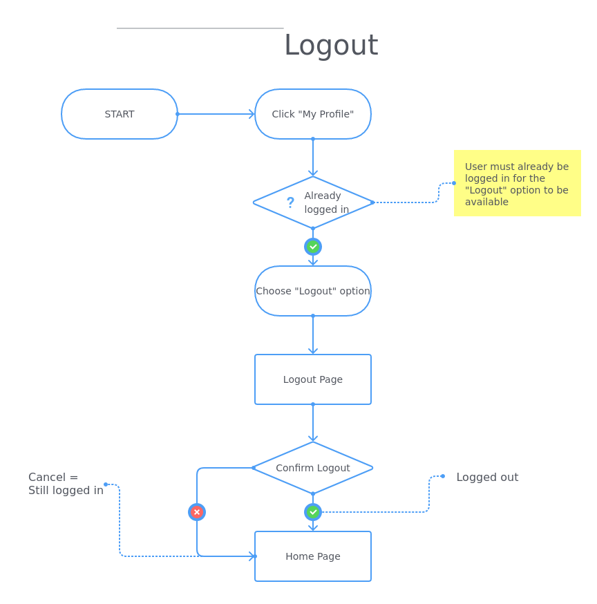

All logged in users, regardless of their role, can log out of the OT4U application.  The logout feature asks the user to confirm that they want to logout.  This puts control in the hands of the user as they have more options, and will help prevent 'accidental' logouts.  This additional control will improve the user experience for logged in users.

Supporting page - **Logout page**

|  Desktop   |  Mobile   |
| --- | --- |
|     |     |


#### Register
[Back to Top](#top)


Before a client can log into the OT4U website they must have registered on the website.  A gmail account was created for the OT4U website (ot4u.mail@gmail.com).  A google app was created for this account.  The OT4U website was set up to use the google mail server, via this google app to send the appropriate emails.


Supporting Page - **Registration page**

|  Desktop   |  Mobile   |
| --- | --- |
|     |   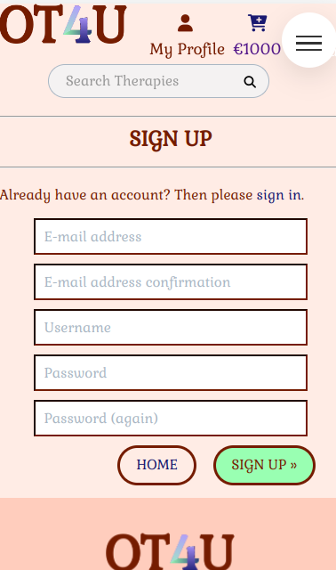  |


#### Reset Password
[Back to Top](#top)


This feature can be a life-saver for any client who forgets their password and needs to login to the OT4U website.  It can be very frustrating for an end-user if they cannot a service that they need, so the benefits of this feature cannot be underestimated.

When the client requests a reset of their password, they are taken to the password reset request page, where they submit their email address.  If their email address is one of the clients' email addresses a password reset email is sent to that address.  This is a key step in resetting the client's password and is required so that the password reset process can begin.

Supporting Page - **Password Reset Request**

|  Desktop   |  Mobile   |
| --- | --- |
|     |     |

The client is shown a password reset sent page, with the option to return to the home page.  This page informs the user that the password reset email was sent.  Without this page the client might not realise that the email was sent and that they need to check their email.  If this was the case the client could lose confidence in the OT4U website.  Therefore this page is an important part of keeping the client's trust in the OT4U website.

Supporting page - **Confirm password reset email sent**

|  Desktop   |  Mobile   |
| --- | --- |
|     |     |

When the client accesses the password reset link sent to them in the email, they are taken to the change password page.  This is where the client enters a new password (and confirms the new password).  This is the core piece of functionality for this feature.  The client gets to change their password.  Doing this will change the client's mood from one of frustration to one of positivity.  The client realises that they are achieving something and are not stuck without a way to log into the OT4U website.

Supporting page - **Change Password**

|  Desktop   |  Mobile   |
| --- | --- |
|     |     |


Once the client submits the new password they are taken to the password changed page, where they are informed of the successful change of their password.  They are given a link back to the home page.  The client may go back to the home page, try to login again with their new password, or visit any of the pages via the navigation menu.  This page confirms that the client has successfully changed their password.  This page gives the client absolute assurance that they have achieved their goal and will have access to the OT4U website.  This is a very positive user experience that leaves the client trusting the OT4U website, and they will have a high level of confidence in the website.

Supporting page - **Confirm Password Changed**

|  Desktop   |  Mobile   |
| --- | --- |
|     |     |

#### User Roles
[Back to Top](#top)

In the OT4U web application there are 2 roles that a user can log in as:
* Client
* Site Owner

Depending on the role assigned to the user, when they log in they will see the same page but with different role-specific options under the "My Profile" menu.

#### View Therapies
[Back to Top](#top)


This feature will show clients and potential clients a list of Occupational Therapies offered by the OT4U website.  By seeing a range of different Therapies, the client can make an informed decision as to the correct therapy to suit their particular needs.

|  Desktop   |  Mobile   |
| --- | --- |
|     |     |

For each therapy the website shows a card which contains the name of the therapy, a description of the therapy, the style of the therapy and the cost of the therapy.  Informing the client of what the therapy does and what the style of the therapy is allows the client to make an informed decision as to which is the correct therapy to suit the particular problem they have.  This choice gives the client a feeling of control, since they are choosing which therapy they will book.  This gives a positive user experience, and the website as well as the therapy will help the client to feel better.

The bright "Read More" button is a primary 'call to action'.  It is deliberately out of sync with the colour scheme in order to draw the client's attention to where they need to go.

Seeing a variety of Occupational Therapy options gives the client a choice as to what they will pick for their particular ailment.  This choice gives the client a feeling of being in control.  Giving the client this feeling of control makes the client happy with the site and will build trust.

#### Filtering Therapies
[Back to Top](#top)

At any time the client can view a list of only the therapies in a particular style by using the "Therapies" menu.  It has a dropdown menu which can be accessed by hovering over the "Therapies" link in the navigation bar on desktop screens, or by clicking the "Therapies" link in the navigation menu on mobile screens.

Once on the Therapies page, the client can filter the Therapies by clicking on one of the "Styles" buttons on the top of the page.  Once the client has chosen to filter the therapies, either from the Therapies menu, or using one of the "Styles" buttons; the "Styles" button for the filtered therapies is highlighted.

The options are the same whether clicking on a menu item, or choosing a "Styles" button.  The client can filter by:
1. Equine therapies
2. Literact therapies
3. Self-care therapies
4. All therapies

The benefit of the filtering feature is that it allows the client to drill down to a specific type of therapy that interests them.  It removes all irrelevant therapies, thus reducing the cognitive load on the client.  They can focus on only what is pertinent to their needs.  This makes it much easier to navigate the options available to them, and makes it much more likely that they will book a session.

The advantage of having the "Styles" buttons on the Therapies page are twofold.
1. It highlights which therapies are being shown to the client.  They do not need to remember which filter they chose.  This makes the OT4U website much easier to learn and to use.
2. The client can change to a different filter simply by clicking another filter button.  They will never feel lost in the OT4U website, since they have all options open them at all times.

Supporting page elements - **Therapies menu**

|  Desktop   |  Mobile   |
| --- | --- |
|  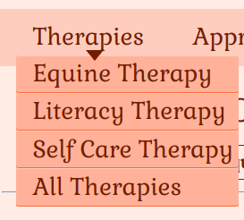   |     |

Supporting page elements - **Filter buttons**

|  Desktop   |  Mobile   |
| --- | --- |
|     |     |

The filtering feature of the OT4U website also gives information feedback to the client.  They are shown how many therapies there are in the chosen style.  Having this information allows the client the make an informed decision on choosing a therapy to book and lets them know where they are in the overall picture.

Supporting page elements - **Filter feedback**

|  Desktop   |  Mobile   |
| --- | --- |
|     |     |


#### Sorting Therapies
[Back to Top](#top)

The purpose of this feature is to allow the client to sort the therapies in a number of ways.  This allows the client find the most relevant therapy in a fast and efficient manner, making the OT4U easy to use and easy to navigate.

There are a number of sorting strategies the client can use:
1. By name - both ascending and descending
2. By price - both ascending and descending
3. By style - both ascending and descending

There is also an option to reset the sorting.  This option is visibly separated from the rest of the sorting options making it obvious that it is a different sorting option from the others.  This will let the client feel in control of the sorting as they know that they can always get back to the way the page was laid out originally.

If the client has already filtered the therapies (by style) they can still sort the filtered results.  When sorting filtered results the option to sort by style are removed, since only one style is shown.  This removal of irrelevant options reduces the amount of memorisation the client needs to perform and reduces their cognitivie load.

Supporting page elements - **Sorting menu**

|  Desktop   |  Mobile   |
| --- | --- |
|     |     |


#### Searching Therapies
[Back to Top](#top)


This feature allows the client to search for therapies with either a particular name, or with a term that appears in the therapies description.  This allows the client to narrow down the list of suitable therapies.  Having this feature means that the client can remove all irrelevant therapies and quickly focus on therapies that are applicable to them.  This will make it quicker for them to come to a decision to book a therapy session.

A search bar is available across the top of all pages, making this search option available to the client at all times.

Supporting page elements - **Search bar**

|  Desktop   |  Mobile   |
| --- | --- |
|     |     |


If no therapies are found with the search term, a suitable image is shown informing the client in a visual way that there were no results for the search term they were looking for.  This removes any doubt from the client's mind as to what the OT4U website is doing.  They are receiving unambiguous feedback even in the event of a 'failure'.

Supporting page - **No Search results**

|  Desktop   |  Mobile   |
| --- | --- |
|     |     |


#### View a single Therapy
[Back to Top](#top)

Once a client clicks on the "Read More" button for a particular therapy the Single Therapy page of the chosen therapy is displayed.  The purpose of the Single Therapy page is to entice the client to book a number of sessions for that therapy.

This page shows a larger image, the therapy name, details, style and cost.  If there is a location, or extra requirements for the therapy they are shown here as well.

A "number of sessions" input is pre-filled with the recommended number of sessions for the specific therapy.  A "Book" button is the primary 'call to action'.  It is deliberately out of sync with the colour scheme in order to visually draw the client's attention to where they need to look and prompt them to take action.

The Single Therapy page will give more information on the therapy, such as equipment to be used, location where applicable and any additional requirements.

The client can choose the number of sessions they wish to book, and still has the option to return back to the Therapies list.  These choices mean that the client is never forced down any one path and has the freedom to browse around until they find the correct fit for them.

|  Desktop   |  Mobile   |
| --- | --- |
|     |     |


#### Maintain Therapies
[Back to Top](#top)


When logged in with an Admin role the user has access to the 'Maintain Therapies' features.  The first feature is "Add Therapies" this allows the Site Owner to add new therapies to the website.  The benefit of this feature is that it makes the website flexible and keeps it fresh.  Natalia can add new therapies as her skillset improves, new facilities become available and new innovations in Occupational Therapy are invented.

Supporting page elements -  **Maintain Therapies link**


Natalia will see the Maintain Therapies option when she click on/hovers over the My Profile menu.  The OT4U website will provide with a list of existing therapies and a large button called "Add Therapy".  

When she clicks the "Add Therapy" button she is presented with a form, which enables her to add details for the new therapy.  Required field have a placeholder with an asterisk which lets her know which fields she must put an entry into.  This means that she does not have to think about or remember which fields need entries.  She can choose the Style for the therapy from a dropdown list, so she does not have to memorise these either.  There is a large button which makes it easy for her to upload an image for the therapy.  Once she has added the therapy she is brought  back to the "Add Therapy" page.  This allows her to add more than one therapy at once, which speeds things up when she is setting up new therapies.

When she is finished adding therapies she clicks the "Cancel" button and is brought back to the Therapies list page, where she can continue modifying therapies.

Supporting pages - **Therapy List**

|  Desktop   |  Mobile   |
| --- | --- |
|     |     |

|  Desktop   |  Mobile   |
| --- | --- |
|     |     |


#### Edit Theraphy
This feature allows Natalia to make changes to Therapies that she has already added to the OT4U website.  It gives her the flexibility to keep the website up to date and fresh.

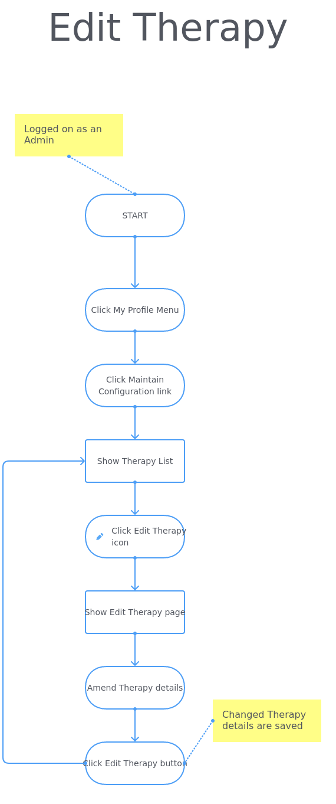

On the Therapy List page there are rows of therapies, one per row.  At the end of each row is the well recognised pencil symbol.  This symbol is well known as the symbol for editing.  This means that Natalia already has a mental model of it means, she does not have to think or remember.  When Natalia clicks this icon she is taken to the Edit Therapy page.  This page has a form similar to the Add Therapy page, except that the details for the chosen therapy are filled in.  Natalia can change any of them, or even the picture.  She then clicks the Edit Therapy button and the OT4U website saves the amndments to the therapy.  These changes are visible immediately.  However, if Natalia changes her mind or wants to amend a different therapy she can click the Cancel button instead and she will be taken  back to the therapy list.  This leaves Natalia in control and she is never forced into an action she cannot back out of.

Supporting pages - **Edit Therapy**

|  Desktop   |  Mobile   |
| --- | --- |
|     |     |


#### Delete Therapy
If Natalia needs to remove a therapy from the OT4U website, she will use this feature.  It helps to prevent the website from growing stale, or accumulating lots of therapies that no client needs.


On the Therapy List page there are rows of therapies, one per row.  At the end of each row is the well recognised bin symbol.  This symbol is well known as the symbol for deleting.  This means that Natalia already has a mental model of it means, she does not have to think or remember.  When Natalia clicks this icon she is given a prompt asking whether she is certain that she wants to delete this therapy.  This  feature helps prevent mistakes from happening and therapies being accidentally removed from the website.  Once Natalia confirms that she wants to delete the therapy the OT4U website removes the therapy and it is no longer available.

Supporting pages - **Therapy List**

|  Desktop   |  Mobile   |
| --- | --- |
|     |     |

A message confirming which therapy was deleted is shown after the therapy is deleted.  This keeps Natalia informed of what the OT4U website is doing.


#### Book Sessions
[Back to Top](#top)


On the Single Therapy page for each therapy, the client has an option to Book a number of sessions for that therapy.  This is the primary 'Call to Action' of the OT4U website.  The "Book" button is highlighted in a different colour to the colour scheme of the OT4U website.  This draws the client's eye, let's them know the next step that is expected and encourages them to click on the button and make a booking.

A "number of sessions" input is pre-filled with the recommended number of sessions for the specific therapy.  A "Book" button is the primary 'call to action'.  It is deliberately out of sync with the colour scheme in order to visually draw the client's attention to where they need to look and prompt them to take action.

The client can choose the number of sessions they wish to book, and still has the option to return back to the Therapies list.  These choices mean that the client is never forced down any one path and has the freedom to browse around until they find the correct fit for them.

|  Desktop   |  Mobile   |
| --- | --- |
|     |     |


#### View My Bookings
[Back to Top](#top)

Once the client makes a booking the shopping cart icon changes to a filled cart icon.  This is a subtle signifier that they have made a booking that needs to be purchased.  A less subtle signifier is the total cost of all bookings this client has made, which is shown under the shopping cart icon.

Supporting screen elements - **Cart Icon**

||  Desktop   |  Mobile   |
| --- | --- | --- |
| Empty |  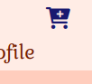   |     |
| Filled |  |  |

By clicking on the cart icon or the total, the client will be taken to their Bookings page.  The purpose of this page is to show the client all the therapies they have booked and how many sessions they have booked for each therapy.

This page will calculate the subtotal for each therapy by multiplying the price of the therapy session by the number of sessions booked.  This lets the client know exactly how much they will be paying for each therapy booked, and takes the onus off the client having to do this multiplication themselves.

This page will also allow the client to adjust their bookings by changing the number of sessions booked for each therapy, and also by removing a therapy completely from the booking.  This gives the client great control over what they have booked.  This flexibility will improve the user experience vastly.

Also, if the client has no bookings or has removed all the bookings on this page, the page will reflect the empty nature of the cart by showing an applicable image and corresponding text.  This difference in layout and visual expression of the nature of the cart will leave the client in no doubt that their cart is empty.

On desktop screens each therapy is shown across the page, with an image, price, number of sessions and subtotal.  After the list of therapies is shown the grand total and a button prompting the client to checkout securely.  There is also a button to let the client go back to shopping for therapies.

On mobile screens the totals and buttons are at the top of the screen.  This is because the therapies details are shown in column format one after the other.  It would be frustrating for the client to have to scroll through all these details if they just wanted to checkout, so the pertinent details needed for a quicker checkout (totals & checkout button) are moved to the top of the page. On mobile screens a helpful text is added just below the totals and buttons, stating "A summary of your bookings is below".

Supporting screens - **Bookings**

||  Desktop   |  Mobile   |
| --- | --- | --- |
| Empty |     |     |
| Filled |  |  |

An additional feature is the checkout button itself, in addition to the word "checkout" this button has the word "SECURE" and a 'lock' icon.  These serve to enhance the client's confidence that the OT4U website is secure and reliable.

Supporting screen elements - **Booking totals**

|  Desktop   |  Mobile   |
| --- | --- |
|     |     |

#### Update Sessions
[Back to Top](#top)

On the Bookings page for each therapy the client can change the number of sessions for each therapy they have booked.  The OT4U website is very flexible in this matter, and provides the client with a number of means to change the number of sessions.  This allows the client to choose the way to update the number of sessions that they prefer, thus improving the user experience.

1. Use the buttons which are placed either side of the input box which contains the number of sessions.
2. Type the number manually into the text box.
3. Use the up and down arrows provided by the browser for adjusting the value in a numeric input box.

When the client adjusts the number of sessions, an "Update" link appears under the number of sessions input box.  When the client clicks this link the OT4U website recalculates the subtotal for that therapy, and recalculates the grand total.

Supporting screen elements - **Update number of sessions**

||  Desktop   |  Mobile   |
| --- | --- | --- |
| Default |     |  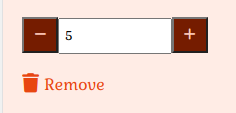   |
| After changing the sessions |  |  |

#### Remove booked therapy
[Back to Top](#top)

In addition to changing the number of sessions for a booked therapy the OT4U website allows the client to remove a therapy completely from their bookings.  If a client accidentally adds the wrong therapy, or changes their mind, they have the option to remove the therapy entirely from their bookings.  This feature removes the frustration that would be associated with adding the wrong therapy.  It allows the client to make mistakes and easily and quickly rectify these mistakes themselves.

The OT4U website automatically recalculates the grand total when a booked therapy is removed.

Supporting screen elements - **Remove booked therapy**

|  Desktop   |  Mobile   |
| --- | --- |
|     |     |

#### Keep shopping
[Back to Top](#top)

The OT4U website gives the client the opportunity to return to browsing the therapies from the Bookings page.  This gives the client the freedom to check their bookings at any time.  They are not forced to continue with purchasing just because they are looking at their booked therapies.  The freedom to view bookings and return to the main site, either using the "Keep shopping" button or the global navigation buttons engenders a sense of trust in the client for the OT4U website.

Supporting screen elements - **Update number of sessions**

|  Desktop   |  Mobile   |
| --- | --- |
|     |     |


#### Purchase Therapy Sessions
[Back to Top](#top)

The central purpose of the OT4U website is to allow clients to purchase OT therapy sessions.  This feature is of utmost importance for the client.  They need this feature in order to get their therapy sessions.  Once a client has booked some sessions they can click on the "Secure Checkout" button and will be brought to a "Purchase" page.  The page will show a summary of the therapies that have been booked and an empty form for the clients to enter their details and card information.  Once the details have been entered the client will click the "Complete Order" button.  The card details and amount are sent to the Stripe credit card service.  Once the money has been transferred a "Purchase Succeeded" page is shown, with a summary of all the details of the order.

All required fields are marked with an asterisk (\*).  This is a common signifier for a required field that should be in everybodies mental model of how web pages work.  This means that the client will understand that these are required fields without any further information needed.  There will be no extra mental burden on the client.

The "Country" field is a dropdown select box.  This makes it unambiguous as to what country has been selected as there can be no typing errors.  Furthermore, Stripe requires that the country input is in the ISO 2 digit form (E.G. IE for Ireland), and this dropdown selector provides the country input in the correct format required by Stripe in order to complete the purchase.

The summary on the "Purchase" page gives the client a reminder of what it is they are purchasing.  This is important because it gives the client clarity on what therapies and sessions they will receive for their purchase.

Supporting page - **Purchase**

|  Desktop   |  Mobile   |
| --- | --- |
|     |  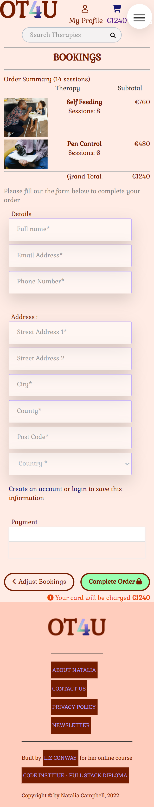   |

Underneath the "Complete Order" button the amount to be charged is shown in red.  This means the client will know exactly how much they are spending when they complete the order.  There will be no confusion or surprises.  This up-front display of key information engenders a sense of trust in the OT4U website, and gives the client confidence in the website.

Beside the "Complete Order" button is an "Adjust Bookings" button which will allow the client to amend their order.  This feature provides the client with the flexibility to change their order, if they have made a mistake or change their mind.

Supporting page elements - **Purchase buttons & total**

|  Desktop   |  Mobile   |
| --- | --- |
|     |  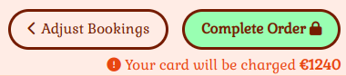   |

Another feature of the "Purchase" page is that you can get to it in a number of different ways:
1. Click on the "Secure Checkout" button from the "Bookings" page
2. Click on the "Secure Checkout" button from the menu that appears whenever you book a therapy
3. Click on the Shopping Cart icon.

This gives the client great flexibility in accessing the "Purchase" page and makes the OT4U website very easy to use and very intuitive.

While Stripe is processing the credit card, the "Purchase" page is disabled and a moving "loading" icon is shown.  This is a common icon that computer users will be aware of.  They know that it means that the website is working in the background.  The disabling of the "Purchase" page is visually signified to the client with an overlay which allows the client to see the page in the background, but disables any interactions with the page.  As well as informing the client that the order is being processed, this feature prevents the user from making changes to the order while it is being processed.  This prevents any errors, or corruption of an order.  The client is assured that the order will be exactly the same as what they ordered, and the charge to their card will be exactly the value that they expect.  This feature makes the OT4U website robust and reliable.

Supporting page elements - **Loading overlay**

|  Desktop   |  Mobile   |
| --- | --- |
|     |  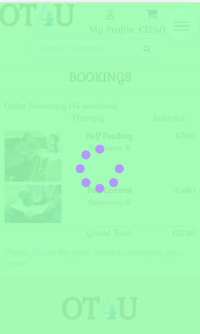   |

#### Purchase Success
[Back to Top](#top)

Once the payment has been processed, the client is shown a "Purchase Succeeded" page.  This page shows a large "Thank You".  Showing gratitude to the user helps to make them feel comfortable with the site.  It also shows them a "Purchase Succeeded" message, giving them their order number and telling them that they will shortly receive an email confirmation.  Keeping the client informed is important as it makes them feel more in control and happier with the website.  The "Purchase Succeeded" page also shows full details of the order, so that the client will know what it is they have ordered.

Supporting pages - **Purchase Success**

|  Desktop   |  Mobile   |
| --- | --- |
|     |     |
|  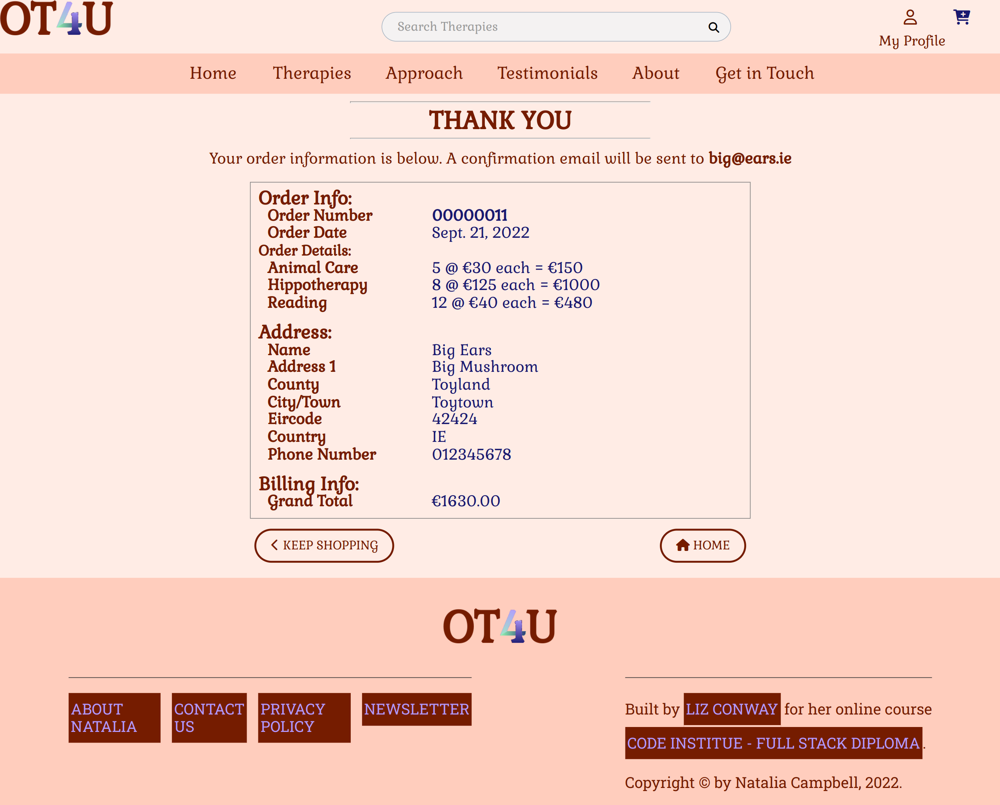   |  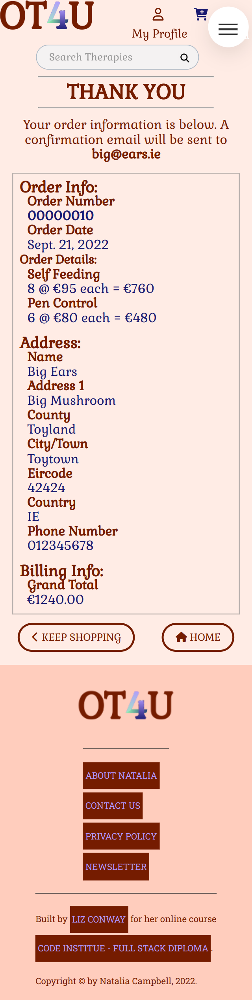   |

This page also has two buttons.  One of these buttons allows the client to go back to home page, the other allows the client to keep shopping.  The purpose of these buttons is to not let the client feel lost on the website, or feel that they cannot get back to where they were.

Supporting page elements - **Purchase success buttons**

|  Desktop   |  Mobile   |
| --- | --- |
|     |  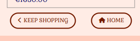   |


#### Purchase Confirmation E-mail
[Back to Top](#top)


On successful purchase the OT4U website will send a confirmation email to the client.  This is a more permanent record of the transaction, since when the client leaves the "Purchase Succeeded" page the order information will be gone from their view.  Having this email allows the client to revisit their order details outside of the OT4U website. 

#### Back-end database checks
[Back to Top](#top)

When the OT4U website passes data to the Stripe system to make a payment, it not only passed card and payment information, it also passes the complete order information.  When the OT4U website receives confirmation from Stripe that a payment has been successful, it performs a number of checks to ensure that one and only one order is saved on the databases for that payment.

The OT4U website validates that the order that was paid for exists in the database.  The OT4U website takes the order details from the Stripe payment information and checks to ensure that the exact same order exists in the OT4U databasse.  In order to take into account any delays on the server-side, the OT4U website will perform this validation up to 5 times with an appropriate wait between each validation.  Once the order has been validated the OT4U website skips the remaining validations.

If a corresponding order is not found on the database, the OT4U website creates the order on the database, using the data from the Stripe payment information.

A client could make more that one booking for the same OT therapy,  In order to verify that these back-end checks do not validate against a similar but different order, extra fields are added to the order.  These extra field guarantee that each order on the database is unique.

This feature ensures the robustness of the OT4U website.  Once a client has made a purchase they are guaranteed that an order will exist.  It would be most frustrating for a client to have paid for something and not receive it.  The value of this feature is that it ensures that the OT4U website works as intended and as the client expects.


#### View Testimonials
[Back to Top](#top)

This feature allows potential clients to view what other people think about the services Natalia gives.  The benefit of this is that sometimes people need "social proof", evidence that their peers like and use a product or service before they will buy it.  This feature will encourage new clients to book Natalia's therapies.

Supporting pages - **View Testimonials**

|  Desktop   |  Mobile   |
| --- | --- |
|     |     |


#### View details about Natalia
[Back to Top](#top)

This feature allows clients and potential clients to view information about Natalia herself.  They will judge whether to book sessions with her based on her experience and attitude.  This feature allows Natalia to sell herself to new clients.


#### Get in Touch
[Back to Top](#top)
The purpose of this feature is to allow Natalia's clients to establish contact and get their queries answered.  Being available to answer questions makes Natalia seem more friendly and trust worthy and will generate more bookings for her.


A MailChimp subscription service is used to allow clients and users to sign up to Natalia's regular newsletter.  This establishes ongoing contact between herself and her clients/potential clients.  She will always be in the forefront of their minds and should be the first person they think of when considering getting OT.

Supporting page elements - **Newsletter Signup**

|  Desktop   |  Mobile   |
| --- | --- |
|     |     |


#### View our Privacy Policy

#### Messages
[Back to Top](#top)

Every time an OT Therapy is booked, updated or deleted or a new OT Therapy is added, amended or deleted, the user is informed via an informational message on the screen.

Whenever invalid information is submitted on a form the user is briefed via error messages.  Error messages are displayed on a red background to emphasize the serious nature of the error.

#### Current Login State
[Back to Top](#top)

The OT4U application keeps the user up to date with where they are in the application by highlighting the appropriate navigation link for the feature of the application that the user is currently employing.

If the client/site owner is not logged in the icon shown above "My Profile" is an outline version of the icon.  If the client/site owner is logged in the icon shown is a filled version of the icon.  This is an extra piece of information for the client/site owner, which means that they do not have to remember if they are logged in or not, the OT4U website will tell them their "login" status.

Supporting page elements - **User account logged out icon**

|  Desktop   |  Mobile   |
| --- | --- |
|     |     |

Supporting page elements - **User account logged in icon**

|  Desktop   |  Mobile   |
| --- | --- |
|     |     |


#### Field Validation
[Back to Top](#top)

All required fields are flagged with a red asterisk, to inform the user that an entry is required in that field.  If the user tries to submit a form without filling in a required field the application will highlight the field and let the user know that they need to fill in the field before submitting the form.


#### Cancel
[Back to Top](#top)

The user can cancel any operation in the middle of it.  No information from the current page is saved and the user is returned to the home page. 

#### Reset
[Back to Top](#top)

When filling a form in the OT4U application, the user can reset the form.  This will clear out any fields and unselect any checkboxes or radio buttons.  Basically this will set the form back to the way it was when the page first loaded.


### Known Bugs
<a id="known-bugs"></a>
[Back to Top](#top)

The order number is generated from the max id in the Orders table.  If two people create an order at the same time, duplicate order numbers could be created.


### Future features
<a id="future-features"></a>
[Back to Top](#top)

Since OT4U is a "real-life" project, this section will be used to "de-scope" some of the Use Cases and User Stories.  This will provide a Minimum Viable Product for the end-user which will also meet the criteria for examination by Code Institute. 

* Add system to select dates for the OT Sessions
	* Allow the Client to pick from available dates and locations for their OT Session.
* Add a separate Order number table to track the order numbers generated and prevent more than one client generating the same order number 


## Data model
[Back to Top](#top)

### Entity Diagram
<a id="entity-diagram"></a>
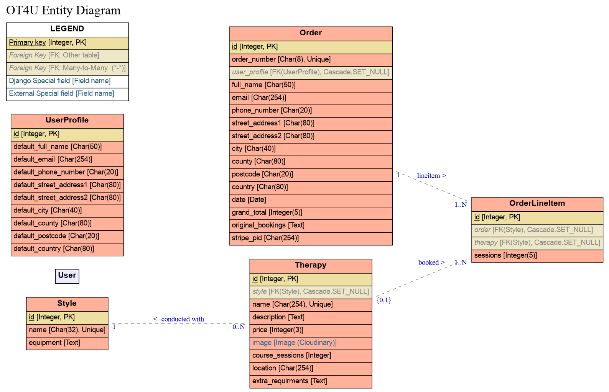

### Entity Relationship Diagram
<a id="erd"></a>
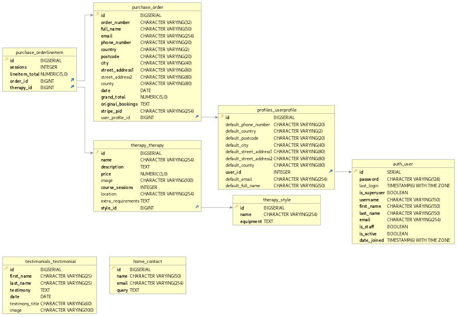

### Python structure
<a id="python-structure"></a>
[Back to Top](#top)

The Django structure for the OT4U application is broken into 4 apps.

1. **maintenance**

	This app contains all the code for pages that the Site Owner will interact with.

2. **therapy**

	The app contains all the code for pages that allow a Client to view and book an OT Service.
	
3.	**profiles**

	This app contains all the code for managing user accounts, including defining roles to be used for authentication.

4.	**bookings**

	This app contains all the code for managing bookings, including a shopping cart where all booked therapy sessions will be handled.


## UX
<a id="ux"></a>
[Back to Top](#top)

### Personas
<a id="personas"></a>
[Back to Top](#top)


### Customer Journey Maps
<a id="cjm"></a>
[Back to Top](#top)


### Wireframes
<a id="wireframes"></a>
[Back to Top](#top)

**Login**


**Home Page**


**OT Therapies**


**Single OT Therapy**


**About**


**Get in Touch**


**Shopping Cart**


**Payment**


**Order Confirmation**


### Site Map
<a id="site-map"></a>
[Back to Top](#top)


### Accessibility
<a id="accessibility"></a>
[Back to Top](#top)

#### Lighthouse Report
[Back to Top](#top)

**Desktop**


**Mobile**


#### WAVE Accessibility tool
[Back to Top](#top)

The OT4U application was checked to ensure accessibility using the [WAVE](https://wave.webaim.org/) web accessibility evaluation tool. 


#### Contrast
[Back to Top](#top)

Using the [Grayscale Browsing extension](https://addons.mozilla.org/en-US/firefox/addon/grayscale-browsing/?utm_source=addons.mozilla.org&utm_medium=referral&utm_content=search) for Firefox, I viewed each page as "black & white" to ensure that I could see all details even if the colour was gone.


**Home**


**Login**


**Logout**


## Design Decisions
[Back to Top](#top)


### Colours
<a id="colours"></a>
[Back to Top](#top)

The main colours for the OT4U application were deliberately chosen to invoke specific emotional reponses from the user.  The colours were taken from the picture on the home page.  The light colours used to highlight/accent a particular area to draw the user's attention were taken from the purple and green balloons.  The pink hues used throughout the website were taken from the Occupational Therapist's face.  The brownish colour was taken from the darker shadows of her top.  The dark blue used to hightlight/accent against a light background was taken from the shadow of the girl's pocket.


The use of colours in the OT4U application should make the user feel welcomed and trusting.  Whilst at the same time the user knows that this is not a "fun" app, but a serious tool that will be used by professionals.

### Usability
<a id="usability"></a>
[Back to Top](#top)

    
- **Suitability for purpose**
    - OT4U provides features that allow for retrieval of information in easily readable formats.
    - OT4U shows information in understable formats, lowering the work the user has to do to interpret the information.
- **Ease of use**
    - A simple easy-to-use application focusing on reducing the 'cognitive load' on Clients.  The system is designed so that clients do not have to remember large amounts of detail.
- **Information Display** 
    - There is a main navigation bar on every page.  This allows navigation to all the main pages from everywhere on the site.
  
  
### Favicon
[Back to Top](#top)

The favicon for the OT4U project was created using [Real Favicon Generator](https://realfavicongenerator.net).  It was created using the OT4U logo.

### Layout and Visual Impact
[Back to Top](#top)

- **Responsive Design** 
    - "Mobile First" design philosophy
    - FlexBox is used to give responsive layouts
    - Media Queries are used for each different screen size the tool will be used on.
- **Navigation** 
    - Straightforward navigation enabling Clients to move easily from one part of the site to another.
    - Main Navbar with *Home*, *Therapies*, *About*, *Approach*, *Testimonials*, *Get in Touch* links on all screen sizes from Tablet in Landscape orientation upwards.
    - On phones and tablets in portrait orientation all navigation links are removed from the page. A "hamburger" icon is provided.  When the "hamburger" icon is clicked a navigation menu appears which covers the entire page.  This navigation menu includes the main navigation links. It also include a large close button.  When the close button is clicked, the navigation menu disappears and the previous page is displayed.  When a link on the navigation menu is clicked, the navigation menu disappears and the appropriate page is shown.
    - Links to *My Profile*, *Shopping Cart* and *Search* above the main navbar on all screen sizes.

- **Image Treatment** 
    - Images are compressed to reduce download times.  [tinypng.com](https://tinypng.com) was used to compress the  image files.
    - Multiple versions of all static images are used, with a smaller image used for smaller devices.  This reduces the download times for tablets and especially mobile devices.  


### Static Files
[Back to Top](#top)

All static files are hosted with **WhiteNoise**.  [WhiteNoise](http://whitenoise.evans.io/en/stable/django.html) allows your web app to serve its own static files, making it a self-contained unit that can be deployed anywhere without relying on an external server.  During deployment to Heroku, Django collects the static files, whitenoise then serves these files, and updates the links in the html pages to point to the appropriate file on WhiteNoise.

### Media files
[Back to Top](#top)

All uploadable media files are hosted on **Cloudinary**.  [Cloudinary](https://cloudinary.com/) allows you to store, transform, optimize, and deliver all your media assets with easy-to-use APIs, widgets, or user interface.  When a user uploads a media file on the OT4U website, it is uploaded to Cloudinary and the appropriate link to that file in Cloudinary is placed in the html.

## Software Development Process
[Back to Top](#top)

### Agile methodology
<a id="agile"></a>The use cases were arranged as Epics, the Epics were broken down into User Stories.  Acceptance criteria were developed for every User Story.

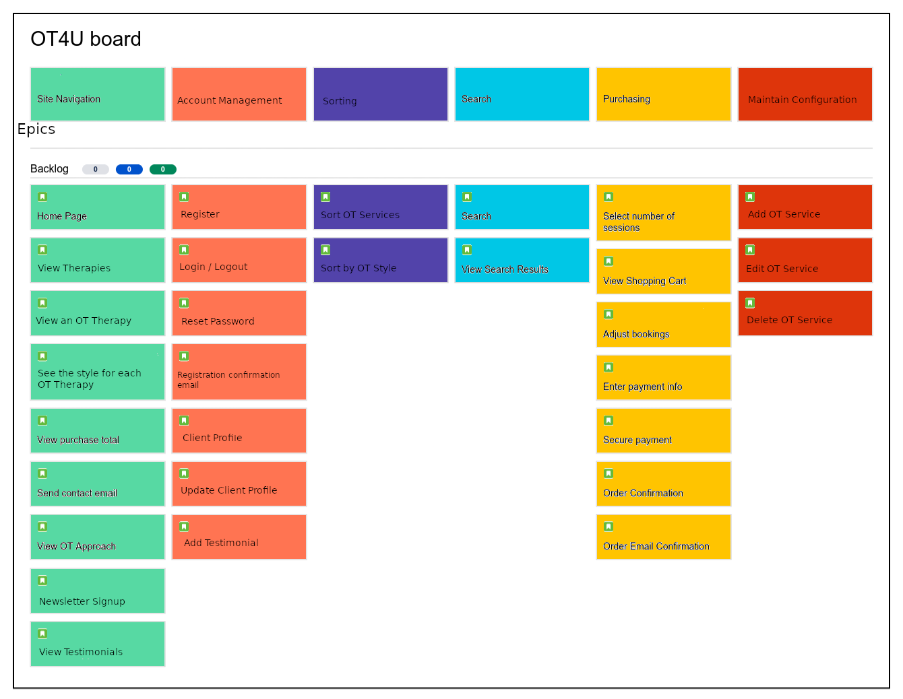


[Trello](https://trello.com/b/MMDat2YT/ot4u) was used as the Agile tool for managing this project.  Each User Story was embodied in a trello card.  Each of these cards was added to a Kanban board.  The Kanban board was set up with a number of lists:


* ToDo
* In Process (Code the ... / Test the ...)
* Testing
* Code review
* Done

When a Story is being coded it is moved from the **ToDo** list into the **In Process** list.  When the code is finished for a story it is moved into the **Testing** list.  Once a story has been tested it is moved to the **Code Review** list.  When the OT4U application as a whole has been reviewed by peers and with the mentor, all the User Stories are moved from the **Code Review** list to the **Done** list and the OT4U application is considered completed.

At the end of the project, all User Stories will be in the **Done** list and the project will be finished.

### Project Planning
<a id="planning"></a>
[Back to Top](#top)

The OT4U project's User Stories have been allocated into Sprints.  The stories in each Sprint will go through the full process of *ToDo* **>** *In Process* **>** *Testing* **>** *Code Review*, before the next Sprint begins.  When all User Stories are in *Code Review*, the project will be peer reviewed. After any changes highlighted by the peer review are made, all the User Stories will be moved into the *Done* column.


#### Initial Plan
[Back to Top](#top)


#### After Sprint 1
[Back to Top](#top)

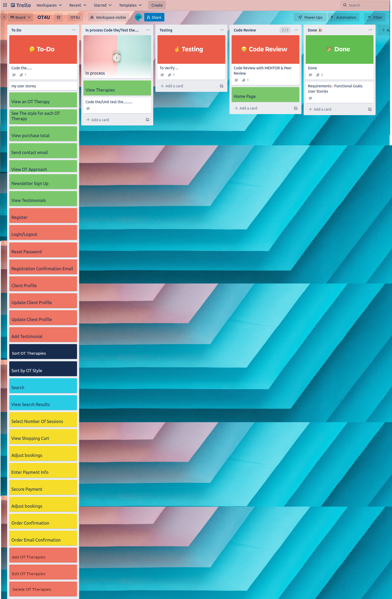

#### After Sprint 2
[Back to Top](#top)


#### After Sprint 3
[Back to Top](#top)

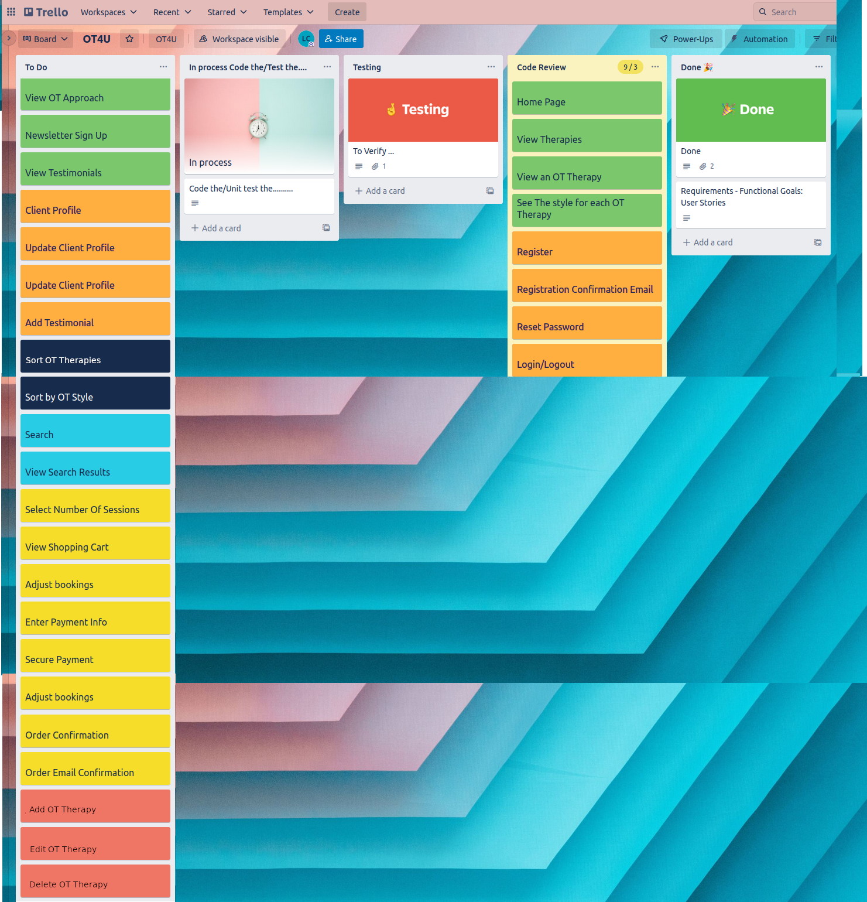


#### After Sprint 4
[Back to Top](#top)


#### After Sprint 5
[Back to Top](#top)


#### After Sprint 6
[Back to Top](#top)


#### After Sprint 7
[Back to Top](#top)


#### After Sprint 8
[Back to Top](#top)


#### After Sprint 9
[Back to Top](#top)

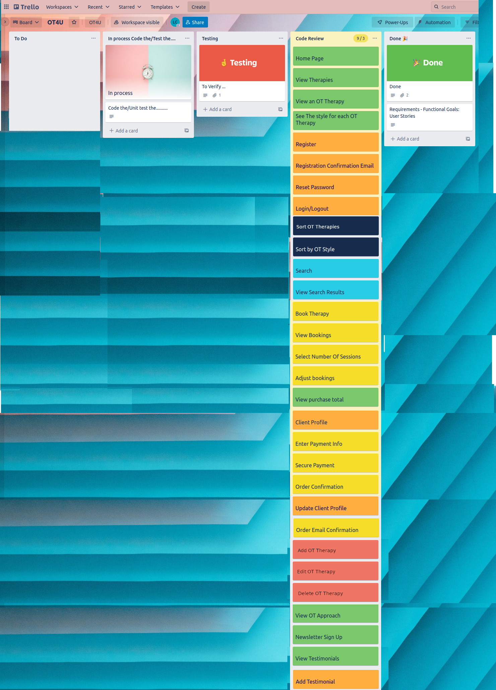


### Version Control 
<a id="git"></a>
[Back to Top](#top)

**Git** is used for version control of this project

- Git commit message prefix convention denoting the type of change made in this commit:
    
	- DOC: Documentation
    - FEAT: Feature
    - FIX: Bugfix
    - STYLE: Changes to CSS
    - REFACTOR: Where changes are made that do not change the functionality.
    - DEPLOY: Changes made for deploying the application
    - TEST: When adding tests
    - ARIA: Changes made to improve accessibility
    
- Git message headings will be no longer than 50 characters long.
- Each line in the Git message body will be no longer than 72 characters long.

**GitHub** is used as the central version control repository for this project.

#### Branches
[Back to Top](#top)

### Testing 
<a id="testing"></a>
[Back to Top](#top)

Testing is documented in the [Testing document](TESTING.md)

### Bug Fixes
[Back to Top](#top)
 


### Validation
<a id="validation"></a>
[Back to Top](#top)

In order to ensure that the code for the OT4U application complies with the latest standards, each aspect of the code was run through an appropriate validator.

#### Python/Django
Source code was validated with [PEP8 Validator](http://pep8online.com/).


#### CSS
[Back to Top](#top)

CSS was validated using [W3C CSS validator](https://jigsaw.w3.org/css-validator/validator)


#### HTML
[Back to Top](#top)

HTML was validated on all pages using [W3C HTML validator](https://validator.w3.org/)
##### Login


##### Logout


##### My Profile


##### Home page


#### Javascript
Javascript was validated using [JSHint](https://jshint.com/)
##### script.js


### Documentation  
<a id="documentation"></a>
[Back to Top](#top)

- **README.md** :  Comprehensive overview of the OT4U application detailing how it works, what its features are, the technologies involved and all the design decisions that were made in creating this web-based application.
- [Vision doc](documentation/requirements/vision-doc.docx) :  Business needs and feature list.
 

### Deployment
<a id="deployment"></a>
[Back to Top](#top)

This project is deployed to [Heroku](https://ot4u-ci.herokuapp.com/)

1. Push the code to Github using `git push`.

2. Go to the [Heroku Dashboard](https://dashboard.heroku.com/apps)

3. In the Heroku Dashboard, click on the *Create new app* button.


4. Enter an app name (*ot4u-ci*) and region (*Europe*) and click the *Create app* button.


5. Click on *Settings* tab


6. In the 'Config Vars' section, click on *Reveal Config Vars*.  Add a key of **PORT** and a value of **8000**.  Click *Add* button.

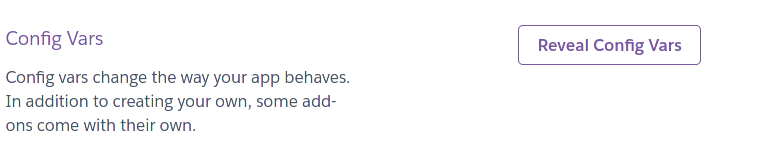


7. Click on *Deploy* tab.


8. Choose Deployment Method *Github*.


9. In *Connect to Github* section, type **OT4U** in the *repo-name* box and click *Search* button.

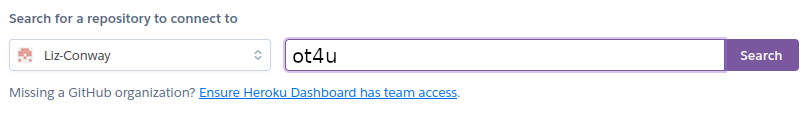

12. Click the *Connect* button next to **Liz-Conway/Project-4-OT4U**.


13. Heroku app is now connected to the Github repository.


14. Go to *Manual deploy* section, ensure the branch to deploy is **main**.  Click on *Deploy Branch* button.

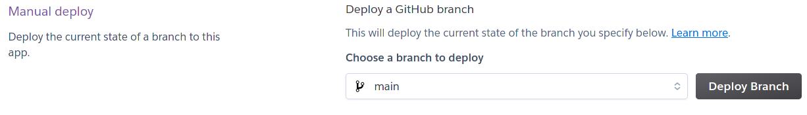

15. Once the app is successfully deployed click on the *view* button, or navigate to [OT4U application](https://ot4u-ci.herokuapp.com/) to run the application.


16. Once the app has been deployed you can access it by navigating to [OT4U application](https://ot4u-ci.herokuapp.com/) to run the application.

## Search Engine Optimisation
[Back to Top](#top)
A list of key search words and phrases was defined for the OT4U website.  This list of phrases was included in the `meta keyword` tag in the base HTML template.  A description containing some essential keywords was used as the `meta description` for the OT4U website.  This meta description is the text that will be displayed below the title in the Search Results page.  This is very important as it is what any client will read to determine if they want to visit the OT4U website.  This meta description was limited to 160 characters, since this is the maximum number of characters that the search engine will show.  The message was crafted to appeal to clients' emotions and get them to react by clicking the link.

* In order to optimise for SEO the following were checked:
* No pages return an error
* All links go to a valid page
* All pages have a unique title tag
* All images are displaying
* A robots.txt file has been included
* A sitemap.xml file has been included
* All external links are working
* All pages have a `h1` tag
* All images have an `alt` tag
* The sitemap.xml file is referenced in the robots.txt file
* No links to CSS or Javascript files are broken
* All anchor `a` tags have descriptive texxt

### robots.txt
```
User-Agent: *
\# Do not crawl any of the maintenance pages
\# I.E. List Therapies, Add Therapy, Edit Therapy, Delete Therapy
Disallow: /maintenance/

\# There is no point in searching these pages
\# as they are subsets of the main Therapies page
Disallow: /therapy/?style=Equine
Disallow: /therapy/?style=Literacy
Disallow: /therapy/?style=Self Care

Sitemap: https://ot4u-ci.herokuapp.com/sitemap.xml
```

### sitemap.xml
```
<?xml version="1.0" encoding="UTF-8"?>
		<!--	created with www.mysitemapgenerator.com	-->
		<urlset xmlns="http://www.sitemaps.org/schemas/sitemap/0.9">
<url>
	<loc>https://ot4u-ci.herokuapp.com/</loc>
	<lastmod>2022-10-01T14:00:14+01:00</lastmod>
	<priority>1.0</priority>
</url>
<url>
	<loc>https://ot4u-ci.herokuapp.com/accounts/signup/</loc>
	<lastmod>2022-10-01T14:00:14+01:00</lastmod>
	<priority>0.6</priority>
</url>
<url>
	<loc>https://ot4u-ci.herokuapp.com/accounts/login/</loc>
	<lastmod>2022-10-01T14:00:14+01:00</lastmod>
	<priority>0.6</priority>
</url>
<url>
	<loc>https://ot4u-ci.herokuapp.com/accounts/logout/</loc>
	<lastmod>2022-10-01T14:00:14+01:00</lastmod>
	<priority>0.6</priority>
</url>
<url>
	<loc>https://ot4u-ci.herokuapp.com/bookings/</loc>
	<lastmod>2022-10-01T14:00:14+01:00</lastmod>
	<priority>0.8</priority>
</url>
<url>
	<loc>https://ot4u-ci.herokuapp.com/therapy/</loc>
	<lastmod>2022-10-01T14:00:14+01:00</lastmod>
	<priority>0.8</priority>
</url>
<url>
	<loc>https://ot4u-ci.herokuapp.com/therapy/?style=Equine</loc>
	<lastmod>2022-10-01T14:00:14+01:00</lastmod>
	<priority>0.8</priority>
</url>
<url>
	<loc>https://ot4u-ci.herokuapp.com/therapy/?style=Literacy</loc>
	<lastmod>2022-10-01T14:00:14+01:00</lastmod>
	<priority>0.8</priority>
</url>
<url>
	<loc>https://ot4u-ci.herokuapp.com/therapy/?style=Self%20Care</loc>
	<lastmod>2022-10-01T14:00:14+01:00</lastmod>
	<priority>0.8</priority>
</url>
<url>
	<loc>https://ot4u-ci.herokuapp.com/testimonials/</loc>
	<lastmod>2022-10-01T14:00:14+01:00</lastmod>
	<priority>0.8</priority>
</url>
<url>
	<loc>https://ot4u-ci.herokuapp.com/about/</loc>
	<lastmod>2022-10-01T14:00:14+01:00</lastmod>
	<priority>0.8</priority>
</url>
<url>
	<loc>https://ot4u-ci.herokuapp.com/philosophy/</loc>
	<lastmod>2022-10-01T14:00:14+01:00</lastmod>
	<priority>0.8</priority>
</url>
<url>
	<loc>https://ot4u-ci.herokuapp.com/contact/</loc>
	<lastmod>2022-10-01T14:00:14+01:00</lastmod>
	<priority>0.8</priority>
</url>
<url>
	<loc>https://ot4u-ci.herokuapp.com/accounts/password/reset/</loc>
	<lastmod>2022-10-01T14:00:16+01:00</lastmod>
	<priority>0.4</priority>
</url>
<url>
	<loc>https://ot4u-ci.herokuapp.com/therapy/1/</loc>
	<lastmod>2022-10-01T14:00:17+01:00</lastmod>
	<priority>0.6</priority>
</url>
<url>
	<loc>https://ot4u-ci.herokuapp.com/therapy/2/</loc>
	<lastmod>2022-10-01T14:00:17+01:00</lastmod>
	<priority>0.6</priority>
</url>
<url>
	<loc>https://ot4u-ci.herokuapp.com/therapy/3/</loc>
	<lastmod>2022-10-01T14:00:17+01:00</lastmod>
	<priority>0.6</priority>
</url>
<url>
	<loc>https://ot4u-ci.herokuapp.com/therapy/6/</loc>
	<lastmod>2022-10-01T14:00:17+01:00</lastmod>
	<priority>0.6</priority>
</url>
<url>
	<loc>https://ot4u-ci.herokuapp.com/therapy/4/</loc>
	<lastmod>2022-10-01T14:00:17+01:00</lastmod>
	<priority>0.6</priority>
</url>
<url>
	<loc>https://ot4u-ci.herokuapp.com/therapy/8/</loc>
	<lastmod>2022-10-01T14:00:17+01:00</lastmod>
	<priority>0.6</priority>
</url>
<url>
	<loc>https://ot4u-ci.herokuapp.com/therapy/7/</loc>
	<lastmod>2022-10-01T14:00:17+01:00</lastmod>
	<priority>0.6</priority>
</url>
<url>
	<loc>https://ot4u-ci.herokuapp.com/therapy/9/</loc>
	<lastmod>2022-10-01T14:00:17+01:00</lastmod>
	<priority>0.6</priority>
</url>
<url>
	<loc>https://ot4u-ci.herokuapp.com/therapy/10/</loc>
	<lastmod>2022-10-01T14:00:17+01:00</lastmod>
	<priority>0.6</priority>
</url>
<url>
	<loc>https://ot4u-ci.herokuapp.com/therapy/5/</loc>
	<lastmod>2022-10-01T14:00:17+01:00</lastmod>
	<priority>0.6</priority>
</url>
<url>
	<loc>https://ot4u-ci.herokuapp.com/testimonials/add/</loc>
	<lastmod>2022-10-01T14:00:18+01:00</lastmod>
	<priority>0.6</priority>
</url>
<url>
	<loc>https://ot4u-ci.herokuapp.com/maintenance/list/</loc>
	<lastmod>2022-10-01T14:00:14+01:00</lastmod>
	<priority>0.6</priority>
</url>
<url>
	<loc>https://ot4u-ci.herokuapp.com/maintenance/add/</loc>
	<lastmod>2022-10-01T14:00:14+01:00</lastmod>
	<priority>0.6</priority>
</url>
<url>
	<loc>https://ot4u-ci.herokuapp.com/maintenance/edit/1</loc>
	<lastmod>2022-10-01T14:00:14+01:00</lastmod>
	<priority>0.6</priority>
</url>
<url>
	<loc>https://ot4u-ci.herokuapp.com/purchase/</loc>
	<lastmod>2022-10-01T14:00:14+01:00</lastmod>
	<priority>0.8</priority>
</url>
<url>
	<loc>https://ot4u-ci.herokuapp.com/purchase/purchase-success/00000001</loc>
	<lastmod>2022-10-01T14:00:14+01:00</lastmod>
	<priority>0.6</priority>
</url>
<url>
	<loc>https://ot4u-ci.herokuapp.com/purchase/view/</loc>
	<lastmod>2022-10-01T14:00:14+01:00</lastmod>
	<priority>0.6</priority>
</url>
<url>
	<loc>https://ot4u-ci.herokuapp.com/profiles/</loc>
	<lastmod>2022-10-01T14:00:14+01:00</lastmod>
	<priority>0.8</priority>
</url>
<url>
	<loc>https://ot4u-ci.herokuapp.com/profiles/orderHistory/00000001</loc>
	<lastmod>2022-10-01T14:00:14+01:00</lastmod>
	<priority>0.6</priority>
</url>
</urlset>
```

## Web Marketing

### Business Model
The OT4U website is a B2C business model that it does the business directly with the end customer. Customer is able to search the product on the site, complete the order, make a payment through secured payment system and receive goods in the end.

### Marketing
A mockup of a Facebook marketing page has been created for the OT4U website.  OT4U has a Facebook page for reaching all Natalia's clients instantly. On a real Facebook site Natalia would be able to post any updates, new therapies or promotions to generate interest in the OT4U website. The Facebook page provides an efficient and effective way of communicating with clients and potential clients.  Since clients can post on the Facebook site this allows Natalia to receive feedback, which can be used to improve the services she offers.


Also on the OT4U website, existing clients can add testimonials, which help market Natalia's therapies.  People often need "social proof" before committing to investing time and money.  The testimonials provide potential clients with insights into what Natalia does and proves to interested parties that Natalia does provide a useful and beneficial service.  This makes it much more likely that the interested party will turn into a valuable client.


## Technology Used
[Back to Top](#top)

### Some of the technology used includes:
<a id="technology"></a>

* [Django](https://www.djangoproject.com)
	- **Django** is a high-level Python web framework that is used to develop the OT4U application.
* [AJAX](https://www.w3schools.com/js/js_ajax_intro.asp)
	- **AJAX** stands for Asynchronous Javascript And Xml. Ajax is a means of loading data from the server and selectively updating parts of a web page without reloading the whole page.
* [jQuery](https://jquery.com/)
	- **jQuery** is a fast, small, and feature-rich JavaScript library. It makes things like HTML document traversal and manipulation, event handling, animation, and Ajax much simpler with an easy-to-use API that works across a multitude of browsers.
* [SASS](https://sass.com/)
	- **SASS** is CSS with Superpowers.  Sass is the most mature, stable, and powerful professional grade CSS extension language in the world
	- **[Koala](http://koala-app.com/)** is used to compile the SASS files into CSS, and auto-prefix particular CSS properties.
* [Heroku](https://heroku.com/)
    - **Heroku** is used to host and run the OT4U application.
* [Trello](https://trello.com/)
	* Trello is used as the Agile project planning tool for the OT4U application.


## Contributing
[Back to Top](#top)

### Clone
<a id="clone"></a>

1. Firstly you will need to clone this repository by running the `git clone https://github.com:Liz-Conway/OT4U.git` command

2. After you've that you'll need to make sure that you have a package manager such as **npm**  installed
   You can get **npm** by installing Node from [here](https://nodejs.org/en/)
   
3. Make sure that you have **python 3** installed. You can install this by running the following: `npm install -g python3` .  This also may require `sudo` on Mac/Linux

4. Make sure that you have **Django** installed. You can install this by running the following: `pip install django`  This also may require `sudo` on Mac/Linux
 
5. Once **Django** is installed run `python3 manage.py runserver` in the root directory (the one where manage.py is).
 
6. Navigate to http://127.0.0.1:8000/ot4u-ci in your browser to run the OT4U application.
 
7. Make changes to the code and if you think it belongs in here then just submit a pull request.

### Fork
<a id="fork"></a>
[Back to Top](#top)

1. Log into [Github](https://github.com/)

2. Search for **OT4U** and choose to go to `Liz-Conway/OT4U`.

3. Click on the *Fork* button on the top right hand side of the screen.
 
4. This will make a copy of **OT4U** in your github account.
 
5. In your version of OT4U click on the `Code` button and copy the clone text.
 
6. Then, you will need to clone this repository by pasting the command you just copied into a terminal window on your computer and running it.  This will create a copy of OT4U from your github account onto your computer.
 
7. After you've done that you'll need to make sure that you have a package manager such as **npm**  installed
   You can get **npm** by installing Node from [here](https://nodejs.org/en/)
 
8. Make sure that you have **python3** installed. You can install this by running the following: `npm install -g python3`  This also may require `sudo` on Mac/Linux

9.  Make sure that you have **Django** installed. You can install this by running the following: `pip install -g django`  This also may require `sudo` on Mac/Linux
 
10. Once **Django** is installed run `python3 manage.py runserver` in the root directory (the one where manage.py is).
 
11. Navigate to http://127.0.0.1:8000/ot4u-ci in your browser to run the OT4U application.
 
12. Make changes to the code and run `git push` to save those changes to your github account.


### Cloning versus Forking
<a id="clone-fork"></a>
[Back to Top](#top)

The major difference between cloning and forking is where your updates go when you perform a `git push`.

With cloning you are pushing the updates to the `Liz-Conway/OT4U` repo on github.

With forking you are pushing the updates to *your own OT4U repo* on github.


## Credit
<a id="credit"></a>
[Back to Top](#top)

### Code
| Code purpose                    | Author               | Link                                                                                 |
| ------------------------------- | -------------------- | ------------------------------------------------------------------------------------ |
| Custom Reset          | Josh Comeau             | https://www.joshwcomeau.com/css/custom-css-reset/   |
| Checkbox Hack | Chris Coyler             | https://css-tricks.com/the-checkbox-hack/   |
| Python Errors                   | TutorialsTeacher.com | https://www.tutorialsteacher.com/python/error-types-in-python                        |
| Check if a string is an integer | Pratik Kinage        | https://www.pythonpool.com/python-check-if-string-is-integer/                        |
|How to pad out strings in Python| Delftstack |https://www.delftstack.com/howto/python/python-pad-string-with-spaces/ |
|Django - Working with form fields | Vitor Freitas |https://simpleisbetterthancomplex.com/article/2017/08/19/how-to-render-django-form-manually.html#working-example |
|Mastering Django Forms | Big Nige |https://djangobook.com/django-tutorials/mastering-django-forms/ |
| Link to Admin Panel | Stack Overflow |https://stackoverflow.com/questions/45122421/refer-to-admin-site-using-url-admin-in-app-django |
| Pass parameter as key to Javascript object | Stack Overflow |https://stackoverflow.com/questions/11113008/in-javascript-how-can-i-use-a-function-parameter-as-the-key-to-an-objecto |
| Pass parameters to a Javascript event handler | Stack Overflow |https://stackoverflow.com/questions/10000083/javascript-event-handler-with-parameters |
|Add attribute to form element | Stack Overflow |https://stackoverflow.com/questions/19489699/how-to-add-class-id-placeholder-attributes-to-a-field-in-django-model-forms |
|Add class to label | Stack Overflow |https://theprogrammersfirst.wordpress.com/2020/07/22/add-class-to-django-label_tag-output/ |
|Django messages | Jaysha |https://ordinarycoders.com/blog/article/django-messages-framework |
|Form postback | Aniruddha Chaudhari |https://www.csestack.org/display-messages-form-submit-django/ |
|Custom filter in Django | Stack Overflow |https://stackoverflow.com/questions/21483003/replacing-a-character-in-django-template |
|Include HTML in Django message | David Winterbottom |https://dzone.com/articles/embedding-html-django-messages |
|Redirect to another page | John Elder |https://www.tutorialspoint.com/django/django_page_redirection.htm |
|Coping with Many-Many relationships | Lacey Williams Henschel |https://www.revsys.com/tidbits/tips-using-djangos-manytomanyfield/ |
|Mobile Navigation system | Luke Embrey |https://alvarotrigo.com/blog/hamburger-menu-css/ |
|Pass data from Django to Javascript | Radoslav Georgiev |https://www.hacksoft.io/blog/quick-and-dirty-django-passing-data-to-javascript-without-ajax |
|How to query with Django | Nensi Trambadiya |https://medium.com/codeptivesolutions/https-medium-com-codeptivesolutions-commonly-used-sql-queries-using-django-orm-e8466e8d4258 |
|How to change the colour of a placeholder | W3 Schools |https://www.w3schools.com/howto/howto_css_placeholder.asp |
|Django model data types | Naveen Arora |https://www.geeksforgeeks.org/positiveintegerfield-django-models/ |
|Layout components in a grid using Flexbox | Kevin Powell |https://www.youtube.com/watch?v=vQAvjof1oe4 |
| Use email with Django | Daniel Diaz |https://www.sitepoint.com/django-send-email/ |
| Wrap text around irregular shape | Nate Weiner |https://www.youtube.com/watch?v=vQAvjof1oe4 |
| robots.txt & sitemap.xml in Django | Jaysha |https://ordinarycoders.com/blog/article/robots-text-file-django |


### Pictures
[Back to Top](#top)

| Picture                    | Name | Owner           | Downloaded and/or adapted from|
| --- | --- | --- | --- |
|| Occupational Therapist playing with child          | Karolina Grabowska | [Pexels.com](https://www.pexels.com/photo/a-mother-and-daughter-playing-with-balloons-7296526/)|
|| Empty shopping cart          | Pawel Czerwinski  | [UnSplash.com](https://unsplash.com/photos/2TKN70nMMts)|
|| Empty shopping cart          | Evgeni Lazarev  | [Pexels.com](https://www.pexels.com/photo/shopping-cart-on-asphalt-8971727/)|
|| Empty shopping cart          | PxHere  | [PxHere.com](https://pxhere.com/en/photo/721180)|
|| Empty shopping cart          | Ivan Samkov   | [Pexels.com](https://www.pexels.com/photo/food-people-laptop-internet-7621354/)|
|| Girl hugging a horse          | Philippe Oursel   | [UnSplash.com](https://unsplash.com/photos/U6Mr3wF8JOk)|
|| Hippotherapy          | Natalia Campbell   | Personal photo |
|| Horse Riding Skills         | @coldbeer   | [Pexels.com](https://www.pexels.com/search/riding%20skills/)|
|| Teach Reading          | Andrea Piacquadio   | [Pexels.com](https://www.pexels.com/photo/elder-sister-and-brother-studying-at-home-3769981/)|
|| Writing          | Yogesh Rahamatkar  | [UnSplash.com](https://unsplash.com/photos/SQdDlk2laPs)|
|| Pen Control          | Anna Shvets   | [Pexels.com](https://www.pexels.com/photo/woman-with-modern-prosthesis-of-hand-writing-in-notebook-5614155/)|
|| Self Feeding          | Vanessa Loring   | [Pexels.com](https://www.pexels.com/photo/food-people-laptop-internet-7621354/)|
|| Cooking          | Maarten van den Heuvel   | [UnSplash.com](https://unsplash.com/photos/EzH46XCDQRY)|
|| Cooking          | PxHere   | [PxHere.com](https://pxhere.com/en/photo/1061452)|
|| Empty jigsaw          | Willi Heidelbach   | [PxHere.com](https://pxhere.com/en/photo/1600619|
|| Magnifying Glass          | Eren Li   | [Pexels.com](https://www.pexels.com/photo/photo-of-magnifying-glass-on-top-of-braille-7188802/)|
|| User Icon  | Mohamed Hassan   | [PxHere.com](https://pxhere.com/en/photo/1441529/)|

### Others
[Back to Top](#top)
An incredible mentor : Daisy McGirr
Fellow students for peer-reviewing this application.
