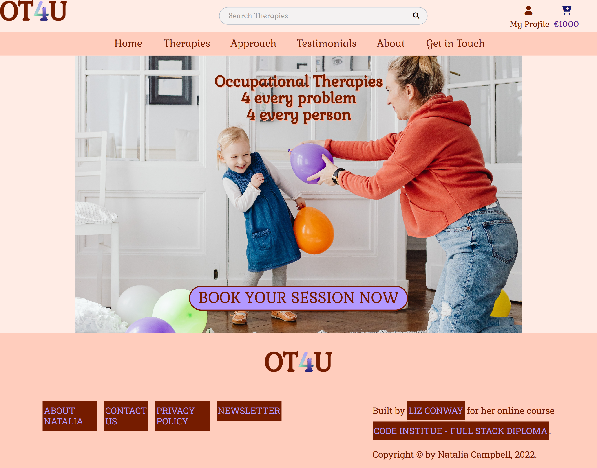

# OT4U - Occupational Therapy for everyone

## Table of Contents

Overview

[Who is this app for?](#who-for)

[What does it do?](#what-do)

Screen Mockup

[Screen Mockup](#mockup)

Features

[Known Bugs](#known-bugs)

[Future features](#future-features)

Data Model

[Entity Model](#entity-diagram)

[Entity Relationship Model](#erd)

[Python Structure](#python-structure)

UX

[Storyboard](#storyboard)

[Personas](#personas)

[Customer Journey Maps](#cjm)

[Wireframes](#wireframes)

[Flow Chart](#flow-chart)

[Site Map](#site-map)

[Accessibility](#accessibility)

Design Decisions

[Colours](#colours)

[Usability](#usability)

Software Development Process

[Agile Methodology](#agile)

[Project Planning](#planning)

[Version control](#git)

[Testing](#testing)

[Documentation](#documentation)

[Deployment](#deployment)

Technology Used

[Technology Used](#technology)

Contributing

[Clone](#clone)

[Fork](#fork)

[Clone versus Fork](#clone-fork)

Credit

[Credit](#credit)

## Overview

### Who is this app for?

 
 
### What does it do?

  
 
### How does it work

## Screen Mockup

## User Stories

The user stories have been divided into different epics:

1. Site Navigation
2. Account Management
3. Sorting
4. Searching
5. Purchase Sessions
6. Maintain Configuration

## Features

### Existing Features

#### Inital Landing page

This is where the user arrives on first entering the site.  The only option a user has is to login to the amber system.  This page sets the theme for the application, with a Logo which when clicked will bring the user back to the home page.

#### Login

Access to the OT4U application is achieved by using the Login feature.

Supporting page - **Login page**

#### Navigation
Each page has a header at the top of the page which contains a logo and a NavBar.

The 'My Account' link allows the user to Login or Register, if they are not logged in already.  Once logged in this link allows the user to Logout or view their Profile.  If the user is logged in as the "Site Owner" this link will also allow them to modify the services on offer to their clients.

On small screen devices the NavBar is accessible by clicking the well recognised "hamburger" icon.  The user is shown a responsive menu on small screen devices.  

On any page if the user clicks the logo they will be redirected to the OT4U home page.  The benefit of this is that it is a consistent behaviour across the entire website.  Also every NavBar has a "Home" link which will also always give the user the option to return to the home page of the OT4U application.  This means that the user can always get back to the home page, no matter where they are in the application.

#### Logout

All logged in users, regardless of their role, can log out of the OT4U application.  The logout feature asks the user to confirm that they want to logout.  This puts control in the hands of the user as they have more options, and will help prevent 'accidental' logouts.  This additional control will improve the user experience for logged in users.

Supporting page - **Logout page**

#### User Roles

In the OT4U web application there are 2 roles that a user can log in as:
* Client
* Site Owner

Depending on the role assigned to the user, when they log in they will see a similar page but with different role-specific options.

#### Site Owner functionality

When logged in with an Admin role the user has access to the 'Product Management' features.

#### Client Functionality

#### Messages
Every time an OT Session is booked, updated or deleted or a new OT Service is added, amended or deleted, the user is informed via an informational message on the screen.

Whenever invalid information is submitted on a form the user is briefed via error messages.  Error messages are displayed on a red background to emphasize the serious nature of the error.

#### Current Login State
The OT4U application keeps the user up to date with where they are in the application by highlighting the appropriate navigation link for the feature of the application that the user is currently employing.

#### Field Validation
All required fields are flagged with a red asterisk, to inform the user that an entry is required in that field.  If the user tries to submit a form without filling in a required field the application will highlight the field and let the user know that they need to fill in the field before submitting the form.

#### Cancel
The user can cancel any operation in the middle of it.  No information from the current page is saved and the user is returned to the home page. 

#### Reset
When filling a form in the OT4U application, the user can reset the form.  This will clear out any fields and unselect any checkboxes or radio buttons.  Basically this will set the form back to the way it was when the page first loaded.

### Known Bugs

### Future features
Since OT4U is a "real-life" project, this section will be used to "de-scope" some of the Use Cases and User Stories.  This will provide a Minimum Viable Product for the end-user which will also meet the criteria for examination by Code Institute. 

* Add system to select dates for the OT Sessions
	* Allow the Client to pick from available dates and locations for their OT Session.

## Data model

### Entity Diagram

### Entity Relationship Diagram

### Python structure

The Django structure for the amber application is broken into ? apps.

1. **maintenance**

	This app contains all the code for pages that the Site Owner will interact with.

2. **services**

	The app contains all the code for pages that allow a Client to view and book an OT Service.
	
3.	**profiles**

	This app contains all the code for managing user accounts, including defining roles to be used for authentication.

## UX

### Personas

### Customer Journey Maps

### Wireframes

**Login**

**Home Page**

**OT Services**

**OT Service Detail**

**About**

**Get in Touch**

**Shopping Cart**

**Payment**

**Order Confirmation**

### Site Map

### Accessibility

#### Lighthouse Report

**Desktop**

**Mobile**

#### WAVE Accessibility tool
The OT4U application was checked to ensure accessibility using the [WAVE](https://wave.webaim.org/) web accessibility evaluation tool. 

#### Contrast
Using the [Grayscale Browsing extension](https://addons.mozilla.org/en-US/firefox/addon/grayscale-browsing/?utm_source=addons.mozilla.org&utm_medium=referral&utm_content=search) for Firefox, I viewed each page as "black & white" to ensure that I could see all details even if the colour was gone.

**Home**

**Login**

**Logout**

## Design Decisions

### Colours
The main colours for the OT4U application were deliberately chosen to invoke specific emotional reponses from the user.

The use of colours in the OT4U application should make the user feel welcomed and trusting.  Whilst at the same time the user knows that this is not a "fun" app, but a serious tool that will be used by professionals.

### Usability
- **Suitability for purpose**
    
- Suitability for purpose
    - OT4U provides features that allow for retrieval of information in easily readable formats.
    - OT4U shows information in understable formats, lowering the work the user has to do to interpret the information.
- Ease of use
    - A simple easy-to-use application focusing on reducing the 'cognitive load' on Clients.  The system is designed so that users do not have to remember large amounts of detail.
- Information Display 
    - There is a main navigation bar on every page.  This allows navigation to all the main pages from everywhere on the site.
  
  
### Favicon
The favicon for the OT4U project was created using [Real Favicon Generator](https://realfavicongenerator.net).  It was created using the OT4U logo.

### Layout and Visual Impact
- Responsive Design 
    - "Mobile First" design philosophy
    - FlexBox is used to give responsive layouts
    - Media Queries are used for each different screen size the tool will be used on.
- Navigation 
    - Straightforward navigation enabling Clients to move easily from one part of the site to another.
    - Main Navbar with *Home*, *OT Services*, *About*, *Get in Touch* links on all screen sizes from Tablet in Landscape orientation upwards.
    - On phones and tablets in portrait orientation all navigation links are removed from the page. A "hamburger" icon is provided.  When the "hamburger" icon is clicked a navigation menu appears which covers the entire page.  This navigation menu includes the main navigation links. It also include a large close button.  When the close button is clicked, the navigation menu disappears and the previous page is displayed.  When a link on the navigation menu is clicked, the navigation menu disappears and the appropriate page is shown.
    - Links to *My Account*, *Shopping Cart* and *Search* above the main navbar on all screen sizes.

- Image Treatment 
    - Images are compressed to reduce download times.  [tinypng.com](https://tinypng.com) was used to compress the  image files.
    - Multiple versions of all images are used, with a smaller image used for smaller devices.  This reduces the download times for tablets and especially mobile devices.  
    - 
### Static Files
All static files are hosted with **WhiteNoise**.  [WhiteNoise](http://whitenoise.evans.io/en/stable/django.html) allows your web app to serve its own static files, making it a self-contained unit that can be deployed anywhere without relying on an external server.  During deployment to Heroku, Django collects the static files, whitenoise then serves these files, and updates the links in the html pages to point to the appropriate file on WhiteNoise.

## Software Development Process

### Agile methodology
The use cases were arranged as Epics, the Epics were broken down into User Stories.  Acceptance criteria were developed for every User Story.

[Trello](https://trello.com/b/0wEVCThe/amber-p4-ci-project) was used as the Agile tool for managing this project.  Each User Story was embodied in a trello card.  Each of these cards was added to a Kanban board.  The Kanban board was set up with a number of lists:

* Story
* ToDo
* Doing always - iteration
* In Process (Code the ... / Test the ...)
* Testing
* Code review
* Done

When a Story is being coded it is moved from the **ToDo** list into the **In Process** list.  When the code is finished for a story it is moved into the **Testing** list.  Once a story has been tested it is moved to the **Code Review** list.  When the OT4U application as a whole has been reviewed by peers and with the mentor, all the User Stories are moved to the **Done** list and the OT4U application is considered completed.

At the end of the project, all User Stories will be in the **Done** list and the project will be finished.

### Project Planning
The OT4U project's User Stories have been allocated into Sprints.  The stories in each Sprint will go through the full process of *ToDo* **>** *In Process* **>** *Testing* **>** *Code Review* **>** *Done*, before the next Sprint begins.

### Version Control 
**Git** is used for version control of this project

- Git commit message prefix convention denoting the type of change made in this commit:
    
	- DOC: Documentation
    - FEAT: Feature
    - FIX: Bugfix
    - STYLE: Changes to CSS
    - REFACTOR: Where changes are made that do not change the functionality.
    - DEPLOY: Changes made for deploying the application
    - TEST: When adding tests
    - ARIA: Changes made to improve accessibility
    
- Git message headings will be no longer than 50 characters long.
- Each line in the Git message body will be no longer than 72 characters long.

**GitHub** is used as the central version control repository for this project.

### Testing 
Testing is documented in the [Testing document](TESTING.md)

### Bug Fixes
 

### Validation

In order to ensure that the code for the OT4U application complies with the latest standards, each aspect of the code was run through an appropriate validator.

#### Python/Django
Source code was validated with [PEP8 Validator](http://pep8online.com/).

#### CSS
CSS was validated using [W3C CSS validator](https://jigsaw.w3.org/css-validator/validator)

#### HTML
HTML was validated on all pages using [W3C HTML validator](https://validator.w3.org/)
##### Login

##### Logout

##### My Profile

##### Home page

#### Javascript
Javascript was validated using [JSHint](https://jshint.com/)
##### script.js

### Documentation  

- README.md :  Comprehensive overview of the OT4U application detailing how it works, what its features are, the technologies involved and all the design decisions that were made in creating this web-based application.
- [Vision doc](documentation/requirements/vision-doc.docx) :  Business needs and feature list.
 

### Deployment
This project is deployed to [Heroku](https://ot4u-ci.herokuapp.com/)

1. Push the code to Github using `git push`.

2. Go to the [Heroku Dashboard](https://dashboard.heroku.com/apps)

3. In the Heroku Dashboard, click on the *Create new app* button.

4. Enter an app name (*amber-ci*) and region (*Europe*) and click the *Create app* button.

5. Click on *Settings* tab

6. In the 'Config Vars' section, click on *Reveal Config Vars*.  Add a key of **PORT** and a value of **8000**.  Click *Add* button.

7. Click on *Deploy* tab.

8. Choose Deployment Method *Github*.

9. In *Connect to Github* section, type **OT4U** in the *repo-name* box and click *Search* button.

12. Click the *Connect* button next to **Liz-Conway/Project-4-OT4U**.

13. Heroku app is now connected to the Github repository.

14. Go to *Manual deploy* section, ensure the branch to deploy is **main**.  Click on *Deploy Branch* button.

15. Once the app is successfully deployed click on the *view* button, or navigate to [OT4U application](https://ot4u-ci.herokuapp.com/) to run the application.

16. Once the app has been deployed you can access it by navigating to [OT4U application](https://ot4u-ci.herokuapp.com/) to run the application.

## Technology Used

### Some of the technology used includes:

* [Django](https://www.djangoproject.com)
	- **Django** is a high-level Python web framework that is used to develop the OT4U application.
* [AJAX](https://www.w3schools.com/js/js_ajax_intro.asp)
	- **AJAX** stands for Asynchronous Javascript And Xml. Ajax is a means of loading data from the server and selectively updating parts of a web page without reloading the whole page.
* [jQuery](https://jquery.com/)
	- **jQuery** is a fast, small, and feature-rich JavaScript library. It makes things like HTML document traversal and manipulation, event handling, animation, and Ajax much simpler with an easy-to-use API that works across a multitude of browsers.
* [jQuery UI](https://jqueryui.com/)
	- **jQuery UI** is a curated set of user interface interactions, effects, widgets, and themes built on top of the jQuery JavaScript Library.
* [SASS](https://sass.com/) ?????
	- **SASS** is a GUI application for Less, Sass, Compass and CoffeeScript compilation, to help web developers to use them more efficientl.
	- **[Koala](http://koala-app.com/)** is used to compile the SASS files into CSS, and auto-prefix particular CSS properties.

* [Heroku](https://heroku.com/)
    - **Heroku** is used to host and run the OT4U application.
* [Trello](https://trello.com/)
	* Trello is used as the Agile project planning tool for the OT4U application.

## Contributing

### Clone

1. Firstly you will need to clone this repository by running the `git clone https://github.com:Liz-Conway/OT4U.git` command

2. After you've that you'll need to make sure that you have a package manager such as **npm**  installed
   You can get **npm** by installing Node from [here](https://nodejs.org/en/)
   
3. Make sure that you have **python 3** installed. You can install this by running the following: `npm install -g python3` .  This also may require `sudo` on Mac/Linux

4. Make sure that you have **Django** installed. You can install this by running the following: `pip install django`  This also may require `sudo` on Mac/Linux
 
5. Once **Django** is installed run `python3 manage.py runserver` in the root directory (the one where manage.py is).
 
6. Navigate to http://127.0.0.1:8000/ot4u-ci in your browser to run the OT4U application.
 
7. Make changes to the code and if you think it belongs in here then just submit a pull request.

### Fork

1. Log into [Github](https://github.com/)

2. Search for **OT4U** and choose to go to `Liz-Conway/OT4U`.

3. Click on the *Fork* button on the top right hand side of the screen.
 
4. This will make a copy of **OT4U** in your github account.
 
5. In your version of OT4U click on the `Code` button and copy the clone text.
 
6. Then, you will need to clone this repository by pasting the command you just copied into a terminal window on your computer and running it.  This will create a copy of OT4U from your github account onto your computer.
 
7. After you've done that you'll need to make sure that you have a package manager such as **npm**  installed
   You can get **npm** by installing Node from [here](https://nodejs.org/en/)
 
8. Make sure that you have **python3** installed. You can install this by running the following: `npm install -g python3`  This also may require `sudo` on Mac/Linux

9.  Make sure that you have **Django** installed. You can install this by running the following: `pip install -g django`  This also may require `sudo` on Mac/Linux
 
10. Once **Django** is installed run `python3 manage.py runserver` in the root directory (the one where manage.py is).
 
11. Navigate to http://127.0.0.1:8000/ot4u-ci in your browser to run the OT4U application.
 
12. Make changes to the code and run `git push` to save those changes to your github account.

### Cloning versus Forking
The major difference between cloning and forking is where your updates go when you perform a `git push`.

With cloning you are pushing the updates to the `Liz-Conway/OT4U` repo on github.

With forking you are pushing the updates to *your own OT4U repo* on github.

## Credit

### Code
| Code purpose                    | Author               | Link                                                                                 |
| ------------------------------- | -------------------- | ------------------------------------------------------------------------------------ |
| Custom Reset          | Josh Comeau             | https://www.joshwcomeau.com/css/custom-css-reset/   |
| Checkbox Hack | Chris Coyler             | https://css-tricks.com/the-checkbox-hack/   |
| Python Errors                   | TutorialsTeacher.com | https://www.tutorialsteacher.com/python/error-types-in-python                        |
| Check if a string is an integer | Pratik Kinage        | https://www.pythonpool.com/python-check-if-string-is-integer/                        |
|How to pad out strings in Python| Delftstack |https://www.delftstack.com/howto/python/python-pad-string-with-spaces/ |
|Django - Working with form fields | Vitor Freitas |https://simpleisbetterthancomplex.com/article/2017/08/19/how-to-render-django-form-manually.html#working-example |
|Mastering Django Forms | Big Nige |https://djangobook.com/django-tutorials/mastering-django-forms/ |
| Link to Admin Panel | Stack Overflow |https://stackoverflow.com/questions/45122421/refer-to-admin-site-using-url-admin-in-app-django |
| Pass parameter as key to Javascript object | Stack Overflow |https://stackoverflow.com/questions/11113008/in-javascript-how-can-i-use-a-function-parameter-as-the-key-to-an-objecto |
| Pass parameters to a Javascript event handler | Stack Overflow |https://stackoverflow.com/questions/10000083/javascript-event-handler-with-parameters |
|Add attribute to form element | Stack Overflow |https://stackoverflow.com/questions/19489699/how-to-add-class-id-placeholder-attributes-to-a-field-in-django-model-forms |
|Add class to label | Stack Overflow |https://theprogrammersfirst.wordpress.com/2020/07/22/add-class-to-django-label_tag-output/ |
|Django messages | Jaysha |https://ordinarycoders.com/blog/article/django-messages-framework |
|Form postback | Aniruddha Chaudhari |https://www.csestack.org/display-messages-form-submit-django/ |
|Custom filter in Django | Stack Overflow |https://stackoverflow.com/questions/21483003/replacing-a-character-in-django-template |
|Include HTML in Django message | David Winterbottom |https://dzone.com/articles/embedding-html-django-messages |
|Redirect to another page | John Elder |https://www.tutorialspoint.com/django/django_page_redirection.htm |
|Coping with Many-Many relationships | Lacey Williams Henschel |https://www.revsys.com/tidbits/tips-using-djangos-manytomanyfield/ |
|Mobile Navigation system | Luke Embrey |https://alvarotrigo.com/blog/hamburger-menu-css/ |
|Pass data from Django to Javascript | Radoslav Georgiev |https://www.hacksoft.io/blog/quick-and-dirty-django-passing-data-to-javascript-without-ajax |
|How to query with Django | Nensi Trambadiya |https://medium.com/codeptivesolutions/https-medium-com-codeptivesolutions-commonly-used-sql-queries-using-django-orm-e8466e8d4258 |
|How to change the colour of a placeholder | W3 Schools |https://www.w3schools.com/howto/howto_css_placeholder.asp |
|Django model data types | Naveen Arora |https://www.geeksforgeeks.org/positiveintegerfield-django-models/ |
|Layout components in a grid using Flexbox | Kevin Powell |https://www.youtube.com/watch?v=vQAvjof1oe4 |

### Pictures

| Picture                    | Name | Owner           | Downloaded and/or adapted from|
| --- | --- | --- | --- |
|| Occupational Therapist playing with child          | Karolina Grabowska | [Pexels.com](https://www.pexels.com/photo/a-mother-and-daughter-playing-with-balloons-7296526/)|
|| Empty shopping cart          | Pawel Czerwinski  | [UnSplash.com](https://unsplash.com/photos/2TKN70nMMts)|
|| Empty shopping cart          | Evgeni Lazarev  | [Pexels.com](https://www.pexels.com/photo/shopping-cart-on-asphalt-8971727/)|
|| Empty shopping cart          | PxHere  | [PxHere.com](https://pxhere.com/en/photo/721180)|
|| Empty shopping cart          | Ivan Samkov   | [Pexels.com](https://www.pexels.com/photo/food-people-laptop-internet-7621354/)|
|| Girl hugging a horse          | Philippe Oursel   | [UnSplash.com](https://unsplash.com/photos/U6Mr3wF8JOk)|
|| Hippotherapy          | Natalia Campbell   | Personal photo |
|| Horse Riding Skills         | @coldbeer   | [Pexels.com](https://www.pexels.com/search/riding%20skills/)|
|| Teach Reading          | Andrea Piacquadio   | [Pexels.com](https://www.pexels.com/photo/elder-sister-and-brother-studying-at-home-3769981/)|
|| Writing          | Yogesh Rahamatkar  | [UnSplash.com](https://unsplash.com/photos/SQdDlk2laPs)|
|| Pen Control          | Anna Shvets   | [Pexels.com](https://www.pexels.com/photo/woman-with-modern-prosthesis-of-hand-writing-in-notebook-5614155/)|
|| Self Feeding          | Vanessa Loring   | [Pexels.com](https://www.pexels.com/photo/food-people-laptop-internet-7621354/)|
|| Cooking          | Maarten van den Heuvel   | [UnSplash.com](https://unsplash.com/photos/EzH46XCDQRY)|
|| Cooking          | PxHere   | [PxHere.com](https://pxhere.com/en/photo/1061452)|

### Others
An incredible mentor : Daisy McGirr
Fellow students for peer-reviewing this application.
